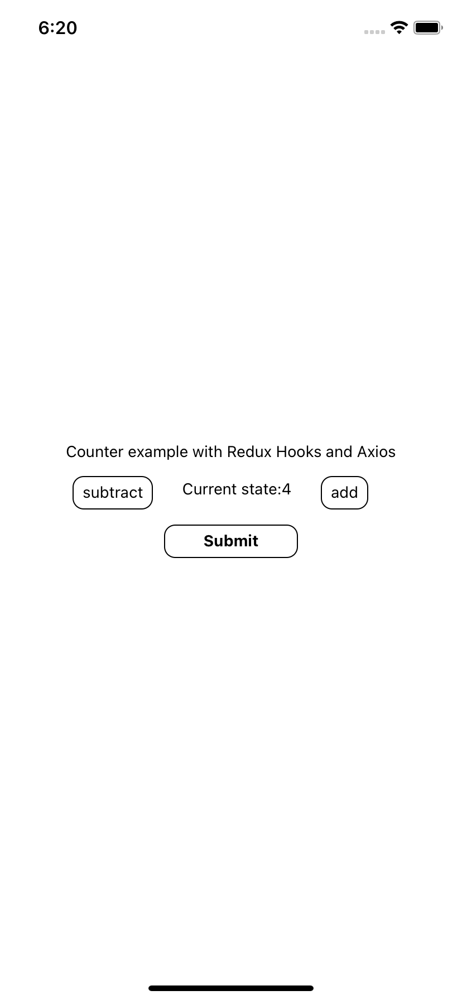

#Redux counter with hooks and axios.

<!--  -->

1. **Add and Subtract values with counter**

2. **Submit the state of your value using axios**

3. **Get the state of your value using axios and render it on your view**
